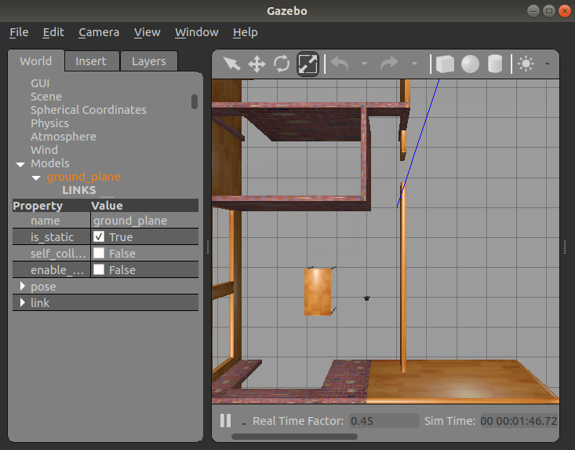
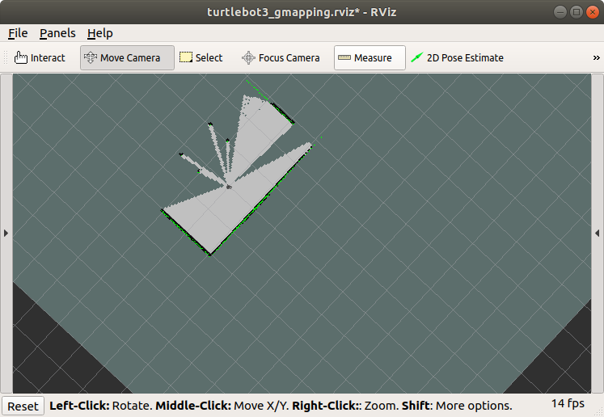
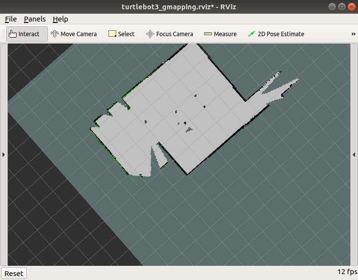

## ROS Task2:

After installing SLAM dependencies, we roslaunch simulated haous in gazebo:

Then launch rviz to show 2D simulation of LiDar readings.

Then launch SLAM gmapping to build house map:

Result after navigation and mapping:

