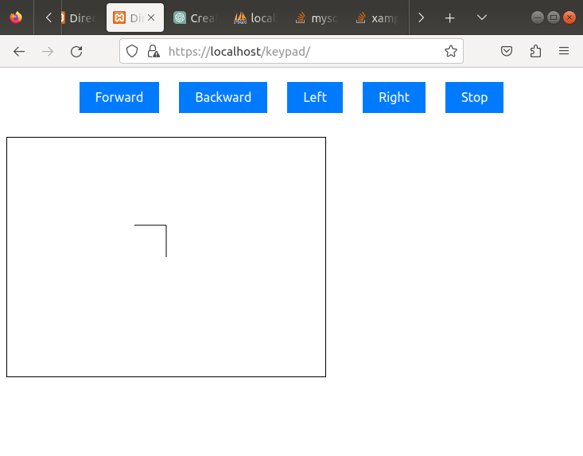
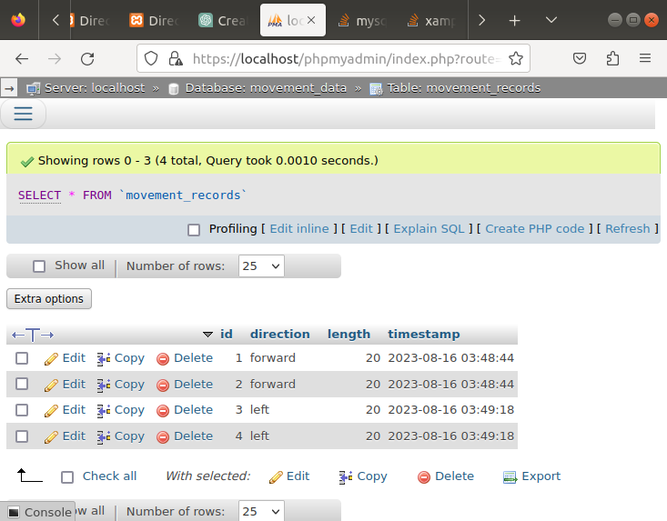

## Task 1:

In this task I create html , js and css files to build directions keypad.

process_button.php is used to control processes and logs.php to show clicks logs from keypad database using phpmyadmin.

## Task 2:

In this task i create new html file index2 to update keypad with directions drawings when click on buttons.
record_movement.php to record directions id, length and timestamps to a table called movement_records

